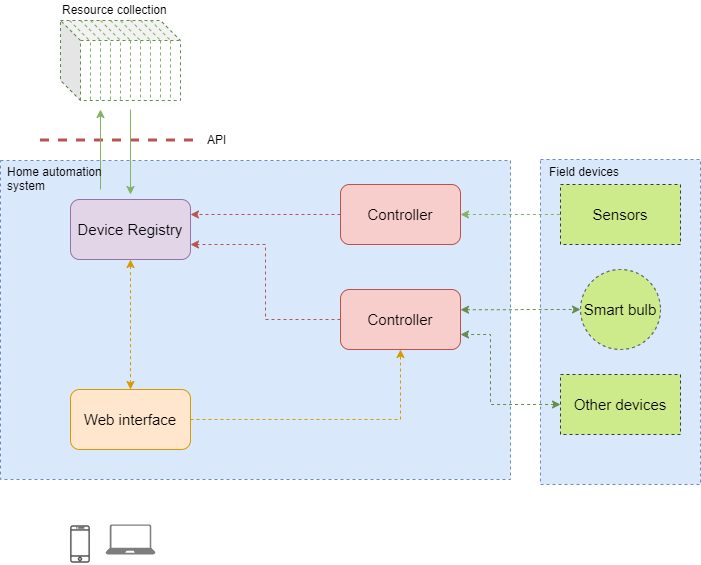

# RESTful-home

Home automation project using REST services on Raspberry Pi. This is mainly supposed to be learning opportunity to better my understanding of both programming languages and the interoperability of an automated system.

# tmp

hue-bridge username: RvA81335RAdFQRi6VQ4t-MsmzWaCZTzWlr6yk21n

