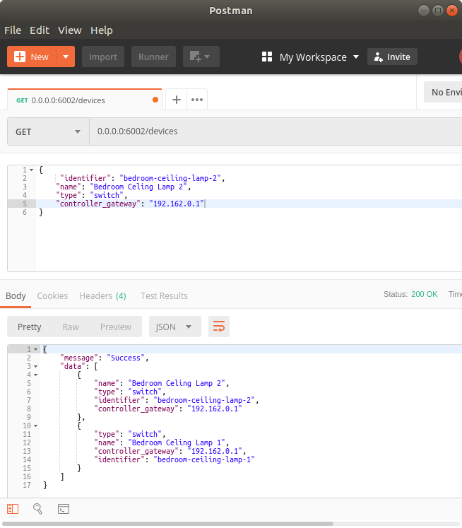

# Device registry service

All resources have the form

```json
{
    "data": "Mixed type holding the content of the response",
    "msg": "Description pof what happened"
}
```

Subsequent response will only detail the expected value of the `data field`

# List of all devices

**Definition**

`GET /devices`

**Response**

- `200 OK` on success

```json
[
    {
        "identifier": "bedroom-lamp",
        "name": "Bedroom lamp",
        "device_type": "switch",
        "controller_name": "RvA81335RAdFQRi6VQ4t-MsmzWaCZTzWlr6yk21n",
        "controller_gateway": "192.1.62.0.1",
        "attributes": {
            "hueId": 1
        }
    }
]
```

## Registering a new device

**Definition**

`POST /devices`

**Arguments**

- `"identifier":string` globally unique identifier for this device
- `"name":string` name for this device
- `"type":string` type of device understood by client
- `"controller_gateway":string` IP address of the device's controller

**Responses**

- `201 Created` on success

```json
{
    "identifier": "bedroom-lamp",
    "name": "Bedroom lamp",
    "device_type": "switch",
    "controller_name": "RvA81335RAdFQRi6VQ4t-MsmzWaCZTzWlr6yk21n",
    "controller_gateway": "192.1.62.0.1",
    "attributes": {
        "hueId": 1
    }
}
```

# Lookup device details

**Definition**

`GET /devices/<identifier>`

**Responses**

- `404 Not Found` if device does not exist
- `200 OK` on success

```json
{
    "identifier": "bedroom-lamp",
    "name": "Bedroom lamp",
    "device_type": "switch",
    "controller_name": "RvA81335RAdFQRi6VQ4t-MsmzWaCZTzWlr6yk21n",
    "controller_gateway": "192.1.62.0.1",
    "attributes": {
        "hueId": 1
    }
}
```

# Delete a device

**Definition**

`DELETE /devices<identifier>`

**Responses**

- `404 Not Found` if device does not exist
- `204 No Content` on success

```json
{
    "identifier": "bedroom-lamp",
    "name": "Bedroom lamp",
    "device_type": "switch",
    "controller_name": "RvA81335RAdFQRi6VQ4t-MsmzWaCZTzWlr6yk21n",
    "controller_gateway": "192.1.62.0.1",
    "attributes": {
        "hueId": 1
    }
}
```

# Postman

Postman is an application which is tailor made to list or add devices currently registered in the database:

